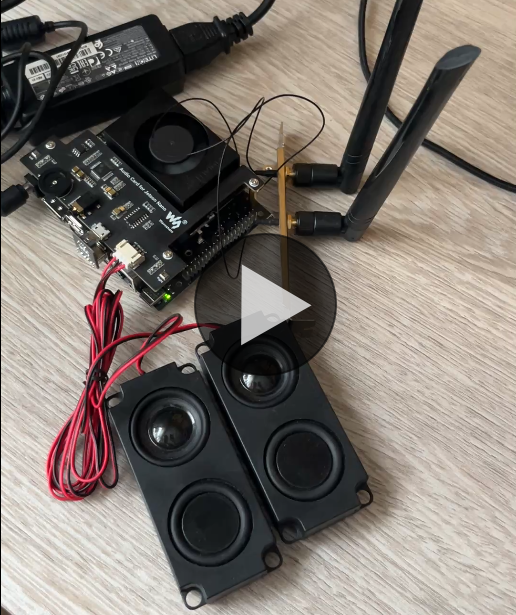

# ai-voice-stack

[](https://github.com/dh3b/ai-voice-stack/actions/workflows/unit.yml)
[](https://github.com/dh3b/ai-voice-stack/actions/workflows/smoke.yml)
[](https://github.com/dh3b/ai-voice-stack/graphs/contributors)
[](https://github.com/dh3b/ai-voice-stack/issues)

## What it is

A local voice assistant. It listens for a wake word, transcribes what you say, runs it through a language model that can call tools, and speaks the reply. Wake word, speech-to-text, LLM, and text-to-speech all run on your own machine - no cloud, nothing leaves the device - and it is built to run on edge hardware such as Jetson boards.

## Quick demo

<table>
<tr>
<td width="50%">

[](demo/IMG_8853.mov)

</td>
<td width="50%">

### Overview

This request took about 2,5seconds to complete (TTFT):
```
[voice_stack.latency]: Turn timings (ms):
[voice_stack.latency]: endpoint_final -> llm_first_token 2092.2
[voice_stack.latency]: llm_first_token -> tts_first_chunk 491.6
[voice_stack.latency]: tts_first_chunk -> audio_first_write 17.3
[voice_stack.latency]: TOTAL endpoint_final -> audio_first_write: 2601.1
```

#### Notes

Usually the chatbot returns the first token in sub 1 second timing. In this example and agent was used to yield the current time.

But with both agent capabilities and the stack being local, it can be used for complete safe hardware use, like camera control or smart home integration.

</td>
</tr>
</table>

### Full logs of that query look like this:

```
[oww]: Listening for wakewords...
[oww]: Wakeword detected with score 0.98698/0.5
[main]: Wakeword detected. Starting STT...
[stt]: Connected to 127.0.0.1:43002
[stt]: Streaming audio to SimulStreaming server...
[stt partial] What's thetime
[stt]: transcript: 'What's the time'
[main]: Transcript: What's the time
[main]: Starting LLM/TTS turn...
[oww]: Listening for wakewords...
[llm]: tool call get_current_time({"timezone": null}): It's 1:51 PM on Thursday, June 18, 2026 (local time).
The current time is 1:51 PM on Thursday, June 18, 2026. Is there anything you need to know about the time in a different timezone?
[latency]: Turn timings (ms):
[latency]:      endpoint_final -> llm_first_token        2092.2
[latency]:      llm_first_token -> tts_first_chunk       491.6
[latency]:      tts_first_chunk -> audio_first_write     17.3
[latency]: TOTAL    endpoint_final -> audio_first_write: 2601.1
[oww]: Listening for wakewords...
```

## How it works

The stack is four components, each a client talking to a local server, wired together by `pipeline.py`.


A turn runs left to right: the wake word listener (openwakeword) triggers on loaded wakeword models, speech-to-text (Whisper, via SimulStreaming) produces a transcript, the LLM (llama.cpp) generates a reply and may call tools while doing so, and text-to-speech (Piper) streams the audio back. Saying the wake word again interrupts a reply in progress (mutable via config), and after each reply it keeps listening briefly so you can follow up without the wake word (also mutable via config). Tools, the backend servers, and the utilities (audio cues, latency timing) sit around that main flowchart.

## Compatibility

- Windows and Linux, on x86_64 and arm64. Targets edge devices such as NVIDIA Jetson; also runs on RPi 4/5 (CPU only, slow).
- Python 3.10+ (provided/managed by `uv` - you don't need it preinstalled).
- A microphone and a speaker.
- A CUDA-capable GPU is recommended; CPU works but the LLM and Whisper will be slow.

There is **no manual build step**. The installer detects your machine and builds
`llama-server`, installs the right `torch`, and clones the STT backend for you; a
separate `task models` downloads the example models - see below.

> [!TIP]
> If you encounter any installation problems, you can always build the dependencies yourself, and link the paths in `config.py`, also view [troubleshooting](#trouble).

## <a name="installation"></a>Installation

Two prerequisites - **`uv`** (Python/venv/deps) and **`task`** ([go-task](https://taskfile.dev), the command runner).

| | uv | task |
|---|---|---|
| **Windows** | `powershell -c "irm https://astral.sh/uv/install.ps1 \| iex"` | `winget install Task.Task` |
| **Linux** | `curl -LsSf https://astral.sh/uv/install.sh \| sh` | `mkdir -p ~/.local/bin`<br>`sh -c "$(curl --location https://taskfile.dev/install.sh)" -- -d -b ~/.local/bin`<br>`echo 'export PATH="$HOME/.local/bin:$PATH"' >> ~/.bashrc` |

Then:

```
git clone https://github.com/dh3b/ai-voice-stack
cd ai-voice-stack
task setup     # detects the machine, installs deps + torch, builds llama.cpp
task models    # downloads the example models (skip if you'll supply your own)
task run       # launches wakeword + STT + LLM + TTS
```

`task setup` can fail when a step genuinely can't
self-install (typically a system C++ compiler, or a full CUDA toolkit on Windows),
it stops with the exact command to run - fix it and re-run `task setup` to continue.
Run `task doctor` any time to see the detected profile and what's still missing.

Everything lands **inside the repo**, never your global environment: the venv in
`.venv/`, the LLM server in `llama_cpp_bin/`, models in `models/`, the STT backend
in `simulstreaming_lib/`.

### Models

`task models` downloads the example models below into `models/`. Set the model paths in `config.py`; feel free to switch
them out.

**To use a different model:** point its path in `config.py` at your file and drop the
file in `models/` yourself. `task models` never overwrites a file that already exists,
so it won't clobber yours (use `task models -- --force` to re-fetch the defaults).
Run `task doctor` once you're done, to confirm everything was done right.

| Model | File | Used for |
|---|---|---|
| Qwen2.5-3B-Instruct (Q4_K_M GGUF) | `Qwen2.5-3B-Instruct-Q4_K_M.gguf` | the LLM - replies and tool calls |
| Whisper base | `whisper-base.pt` | speech-to-text |
| Piper en_US-lessac-medium | `en_US-lessac-medium.onnx` (+ `.onnx.json`) | text-to-speech |
| openwakeword "hey jarvis" | `hey_jarvis_v0.1.onnx` | wake word |

### Granular & advanced

Each phase is a task you can run on its own, and re-running is cheap:

```
task doctor          # report machine profile + gaps
task toolchain       # cmake / ninja / compiler / CUDA
task torch           # torch+torchaudio for the detected accelerator
task stt             # clone SimulStreaming + install its requirements
task llama           # build llama.cpp's llama-server
task llama -- --force --jobs 4   # flags pass through after `--`
task models          # download the example models (-- --force to re-fetch)
task test            # run unit tests
task smoke           # run smoke tests
task clean           # clean build scratch (recommended to offload space after build)
```

- **GPU offload:** after a CUDA `llama` build, set `gpu_layers=99` (and
  `flash_attn=True`) in `LLMServerConfig` in `config.py` to run the LLM on the GPU.
- **Pinned versions:** the llama.cpp ref is `LLAMA_REF` in `installer/build_llama.py`;
  the SimulStreaming ref is `SIMUL_REF` in `installer/setup_stt.py`.

### <a name="trouble"></a>Troubleshooting

- **No C++ compiler** - Windows: install "Build Tools for Visual Studio 2022" with the
  *Desktop development with C++* workload; Linux: `sudo apt-get install -y build-essential`.
  Then re-run `task setup`.
- **CUDA build can't find `nvcc`** - install a CUDA toolkit matching your driver, or let
  the installer try the experimental pip CUDA-wheel route; re-run `task setup`.
- **Jetson** - building on-device is expected; watch power/thermal with `tegrastats`,
  lower `task llama -- --jobs N` or `nvpmodel` if the board resets. The CUDA/Jetson torch
  stack needs `numpy<2`; the installer pins it, so prefer `task setup`/`task torch` over a
  bare `uv sync` (which would restore the locked `numpy 2`).

## Configuration

You can modify every setting by copying the `.env.example` into a `.env` file.
Find out what each setting does in the [config help](CONFIG_HELP.md) reference.

## Adding a tool

Tools are Python functions registered with a schema and exposed to the LLM in agent mode. The functionality is identical to [OpenAI agent tools](https://developers.openai.com/api/docs/guides/function-calling). Drop a module in `modules/tools/` and register a handler:

```python
# modules/tools/weather_tools.py
from modules.tools.registry import registry

@registry.register({
    "type": "function",
    "function": {
        "name": "get_weather",
        "description": "Current weather for a city. Use when the user asks about the weather.",
        "strict": True,
        "parameters": {
            "type": "object",
            "properties": {
                "city": {"type": "string", "description": "City name."},
            },
            "required": ["city"],
            "additionalProperties": False,
        },
    },
})
def get_weather(city: str) -> str:
    ...
    return "Clear, 18C."   # the returned string is fed back to the model
```

Then add the module name to `ToolsConfig.enabled_tool_modules` (here, `"weather_tools"`). The handler's return value goes back to the model as the tool result; raised exceptions are caught and returned as an error string, so the turn does not crash. Handlers run on a timed out worker thread so a slow tool never stalls.

> [!NOTE]
> Feel free to fork the repository and add some tools yourself. I'd be glad to see them.

## Credits

Huge thanks to ÚFAL, for releasing the opensource [SimulStreaming](https://github.com/ufal/SimulStreaming) repository. This project wouldn't be half as efficient without them.

## License
MIT

